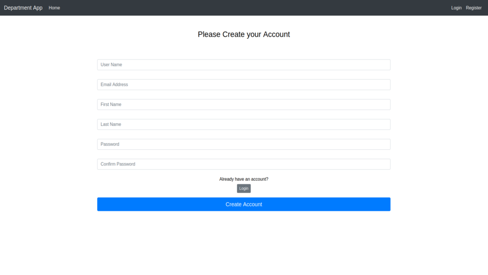
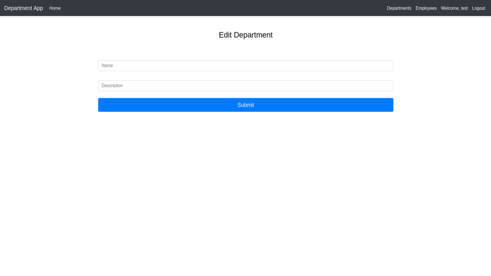

# Department App

Department App is a web application that provides information about departments and employees

The application should provide such functionality:

   1\. Possibility of registration and authorization. The registered user is automatically added to the 'employees' table

   2\. Adding and storing departments and employees in the database

   3\. Display the lists of departments and employees

   4\. Ability to add, edit and delete departments and employees

   5\. Display the number, average salary and age (calculated automatically based on the employees' birthdate) of employees for each department

   6\. Ability to assign an employee to the department

###### P.S.

It is assumed that authorized users have the privileges to add, update and delete information from tables
***
### Home page

When an unauthorized user enters the home page, they see a banner with the 'Get Started' button when clicking on which the user will be redirected to the registration page
When an authorized user enters the home page, they see a banner with the 'View departments' button when clicking on which the user will be redirected to the departments page

##### Main scenario:

User opens a site and see the home page

Pic. 1.1 The home page for unauthenticated user

Pic. 1.2 The home page for authenticated user
***
### Register

Display the registration form 

###### Main scenario:

User clicks the 'Get Started' button on the home page and redirects to the register page and if user already has an account they can click the 'Login' button

Pic. 2 The register form
***
### Login

Display the login form

###### Main scenario:

User clicks the 'Get Started' button on the home page and redirects to the register page where they can redirect to the login page or simply clicks the Login tab.
If user missclicked the Login tab without having a registered account, they can click on 'Register' button.

Pic. 3 The login form
***
### Logout

Ability to logout

###### Main scenario:

Authenticated user can see the 'Logout' tab and clicking it they redirected to the home page

***
### Departments

Display the list of departments

###### Main scenario:

User clicks the 'View Departments' button on the home page and redirects to the departments page or simply clicks the Departments tab where they can see the following columns:

   1\. Name
   
   2\. Description
   
   3\. Employee Count
   
   4\. Average Salary (average salary of all employees in department)
   
   5\. Average Age (average age of all employees in department)
   
   6\. Edit (when clicked redirects to the edit department page where you can update department information)
   
   7\. Delete
   
   In addition, under the table there is a button to add a department when you click on which redirects to add department page

Pic. 4 The list of departments
***
### Employees

Display the list of employees

###### Main scenario:

User clicks the Employees tab and redirects to employees page where they can see the following columns:

   1\. Name (first and last name of the employee)

   2\. Department (to which the employee belongs)

   3\. Salary

   4\. Birthday

   5\. Edit (when clicked redirects to the edit employee page where you can update employee information)

   6\. Assign (to department)

   7\. Delete

   In addition, under the table there is a button to add an employee when you click on which redirects to add employee page

Pic. 5 The list of employees
***
### Add department

Ability to add a new department

###### Main scenario:

User clicks the 'Add Department' button on departments page and application displays the form where user can add new department to the database.
If the information was successfully added, the user is automatically redirected to the departments page where they can see an added department. An alert about this will also be displayed to the user.
In case if department with such name already exists, the user is automatically redirected to the departments page but with alert in which the error is reported

Pic. 6 Add department
***
### Edit department

Ability to edit information about department

###### Main scenario:

User clicks the 'Edit' link on departments page and application displays the form where user can update information about department.
If the information was successfully edited, the user is automatically redirected to the departments page where they can see an updated department. An alert about this will also be displayed to the user

Pic. 7 Edit department
***
### Delete department

Ability to delete department

###### Main scenario:

User clicks the 'Delete' link on departments page and application automatically deletes the department.
If the department was successfully deleted, the user will see an alert about this
***
### Add employee

Ability to add a new employee

###### Main scenario:

User clicks the 'Add Employee' button on departments page and application displays the form where user can add new employee to the database.
If the information was successfully added, the user is automatically redirected to the employees page where they can see an added employee. An alert about this will also be displayed to the user.
If there is an error while adding new employee, the user is automatically redirected to the employees page but with alert in which the error is reported

Pic. 8 Add employee
***
### Edit employee

Ability to edit information about employee

###### Main scenario:

User clicks the 'Edit' link on employees page and application displays the form where user can update information about employee.
If the information was successfully edited, the user is automatically redirected to the employees page where they can see an updated employee. An alert about this will also be displayed to the user

Pic. 9 Edit employee
***
### Assign employee

Ability to assign employee to the department

###### Main scenario:

User clicks the 'Assign' link on employees page and application displays the form where user can choose the department to which they want to assign the employee.
If the employee was successfully assigned, the user is automatically redirected to the employees page where they can see an employee with specified department in 'Department' column. An alert about this will also be displayed to the user

Pic. 10 Assign employee
***
### Delete employee

Ability to delete employee

###### Main scenario:

User clicks the 'Delete' link on employees page and application automatically deletes the employee.
If the employee was successfully deleted, the user will see an alert about this

